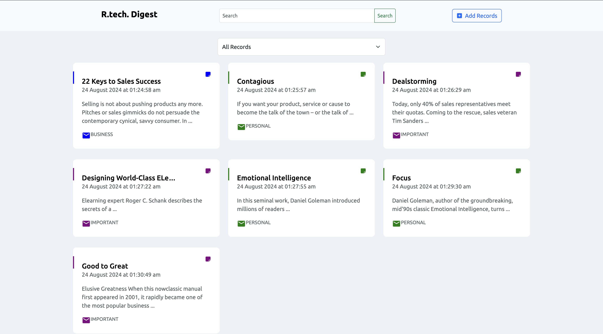
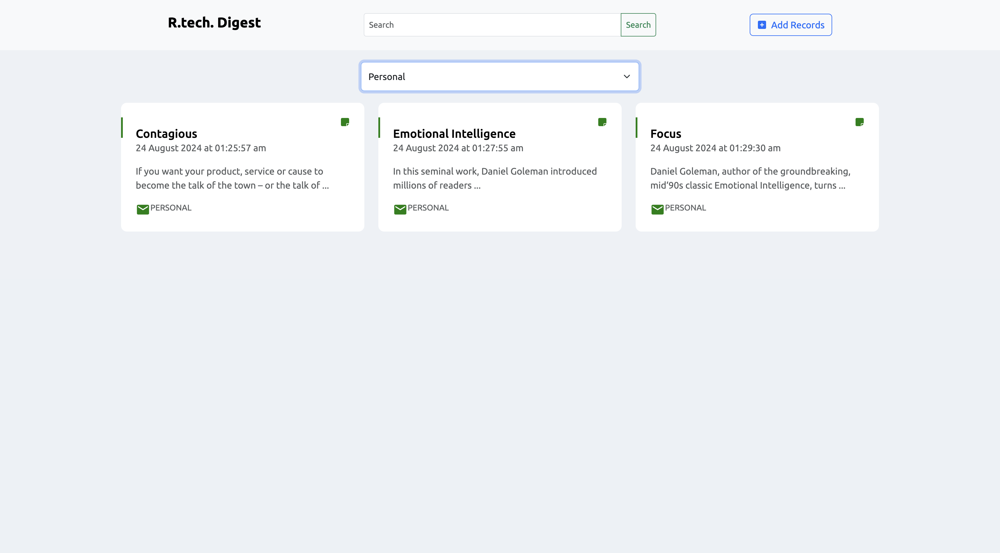
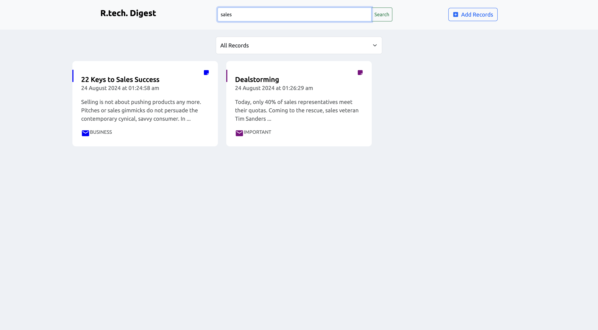
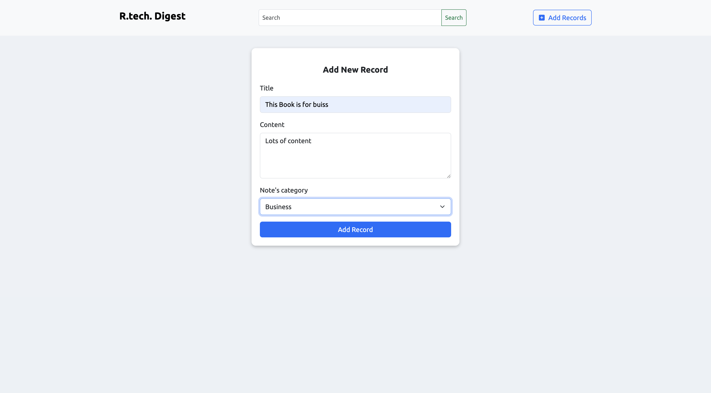
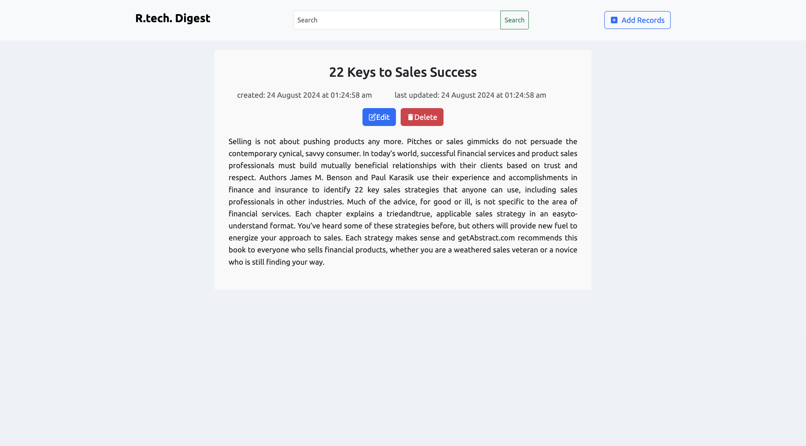

# RT-Frontend

## [YouTube Link](https://www.youtube.com/watch?v=9tm4cIrfKpo)

## Home page, gets all the records

## Filter dropdown, filters the records

## Search box, gets all the superset records

## Add record, posts new records

## Details page gets the record details with edit and delete options

## [Link to backend](https://github.com/AdityaNarayan29/RT-Backend/)
